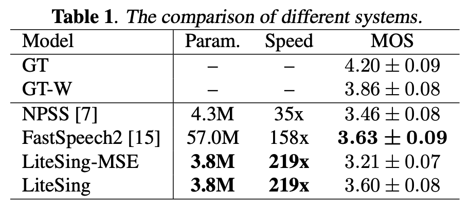

# 
LITESING: TOWARDS FAST, LIGHTWEIGHT AND EXPRESSIVE SINGING VOICE SYNTHESIS

Xiaobin Zhuang, Tao Jiang, Szu-Yu Chou, Bin Wu, Peng Hu, Simon Lui

Tencent Music Entertainment(TME)

## Abstract

 LiteSing proposed in this paper is a high-quality singing voice synthesis (SVS) system, which is fast,
  lightweight and expressive. This model mainly stacks several non-autoregressive WaveNet blocks in
  the encoder and decoder under a generative adversarial architecture, predicts expressive conditions
  from the musical score, and generates acoustic features from full conditions. The full conditions used
  in this model consist of spectrogram energy, voiced/unvoiced (V/UV) decision and dynamic pitch curve,
  which are proved related to the expressiveness. We predict the pitch and the timbre features respectively,
  avoiding the interdependence between these two features. Instead of neural network vocoders,
  a parametric WORLD vocoder is employed in the end for the pitch curve consistency.
  Experiment results show that LiteSing outperforms the baseline model using feed-forward Transformer
  by 1.386 times faster on inference speed, 15 times smaller on training parameters number,
  and almost the same MOS on sound quality. Through an A/B test, LiteSing achieves 67.3% preference
  rate over baseline in expressiveness, which suggests the advantage of LiteSing over the other compared models.
 

## Results

For each singing voice synthesis system, we prepare 40 audio samples and ask 6 listeners to evaluate each sample in three aspects, 
such as **sound quality, pronunciation accuracy,  and expressiveness**. The mean opinion score (MOS) is averaged over all the samples in three aspects.

To compare the improvement in expressiveness, we have an A/B test for evaluating the expressiveness of LiteSing and FastSpeech2 in two aspects: 
**pitch curve and dynamic energy**. It shows that 67.3% supports LiteSing, while only 18.3% supports FastSpeech2. When we feed the full conditions 
extracted from reference recordings to LiteSing, experiment results show that 79.4% supports LiteSing while only 10.1% supports FastSpeech2.

## Singing Voice Samples

\* Note: All audio samples (in 32kHz sampling rate) are in Mandrin Chinese

### Singer: kg_kun (male, 48 minutes, used in this paper)

 

<table align="center">
  <thead>
    <tr>
      <th>Recording</th>
      <th>Reconstruction</th>
      <th>NPSS</th>
      <th>FastSpeech2</th>
      <th>LiteSing-MSE</th>
      <th>LiteSing</th>
    </tr>
  </thead>

  <tbody>
    <tr>
      <td><audio controls="" preload="auto">
            <source src="audio/kg_kun/1024_kunnka_12_recording.wav"></audio></td>
      <td><audio controls="" preload="auto">
            <source src="audio/kg_kun/1024_kunnka_12_world.wav"></audio></td>
      <td><audio controls="" preload="auto">
            <source src="audio/kg_kun/1024_kunnka_12_npss.wav"></audio></td>
      <td><audio controls="" preload="auto">
            <source src="audio/kg_kun/1024_kunnka_12_fs2.wav"></audio></td>
      <td><audio controls="" preload="auto">
            <source src="audio/kg_kun/1024_kunnka_12_lsmse.wav"></audio></td>
      <td><audio controls="" preload="auto">
            <source src="audio/kg_kun/1024_kunnka_12_ls.wav"></audio></td>
    </tr>
  </tbody>

  <tbody>
    <tr>
      <td><audio controls="" preload="auto">
            <source src="audio/kg_kun/1024_kunnka_23_recording.wav"></audio></td>
      <td><audio controls="" preload="auto">
            <source src="audio/kg_kun/1024_kunnka_23_world.wav"></audio></td>
      <td><audio controls="" preload="auto">
            <source src="audio/kg_kun/1024_kunnka_23_npss.wav"></audio></td>
      <td><audio controls="" preload="auto">
            <source src="audio/kg_kun/1024_kunnka_23_fs2.wav"></audio></td>
      <td><audio controls="" preload="auto">
            <source src="audio/kg_kun/1024_kunnka_23_lsmse.wav"></audio></td>
      <td><audio controls="" preload="auto">
            <source src="audio/kg_kun/1024_kunnka_23_ls.wav"></audio></td>
    </tr>
  </tbody>

  <tbody>
    <tr>
      <td><audio controls="" preload="auto">
            <source src="audio/kg_kun/10422_kunnka_18_recording.wav"></audio></td>
      <td><audio controls="" preload="auto">
            <source src="audio/kg_kun/10422_kunnka_18_world.wav"></audio></td>
      <td><audio controls="" preload="auto">
            <source src="audio/kg_kun/10422_kunnka_18_npss.wav"></audio></td>
      <td><audio controls="" preload="auto">
            <source src="audio/kg_kun/10422_kunnka_18_fs2.wav"></audio></td>
      <td><audio controls="" preload="auto">
            <source src="audio/kg_kun/10422_kunnka_18_lsmse.wav"></audio></td>
      <td><audio controls="" preload="auto">
            <source src="audio/kg_kun/10422_kunnka_18_ls.wav"></audio></td>
    </tr>
  </tbody>

  <tbody>
    <tr>
      <td><audio controls="" preload="auto">
            <source src="audio/kg_kun/21379_kunnka_23_recording.wav"></audio></td>
      <td><audio controls="" preload="auto">
            <source src="audio/kg_kun/21379_kunnka_23_world.wav"></audio></td>
      <td><audio controls="" preload="auto">
            <source src="audio/kg_kun/21379_kunnka_23_npss.wav"></audio></td>
      <td><audio controls="" preload="auto">
            <source src="audio/kg_kun/21379_kunnka_23_fs2.wav"></audio></td>
      <td><audio controls="" preload="auto">
            <source src="audio/kg_kun/21379_kunnka_23_lsmse.wav"></audio></td>
      <td><audio controls="" preload="auto">
            <source src="audio/kg_kun/21379_kunnka_23_ls.wav"></audio></td>
    </tr>
  </tbody>

  <tbody>
    <tr>
      <td><audio controls="" preload="auto">
            <source src="audio/kg_kun/6427378_kunnka_9_recording.wav"></audio></td>
      <td><audio controls="" preload="auto">
            <source src="audio/kg_kun/6427378_kunnka_9_world.wav"></audio></td>
      <td><audio controls="" preload="auto">
            <source src="audio/kg_kun/6427378_kunnka_9_npss.wav"></audio></td>
      <td><audio controls="" preload="auto">
            <source src="audio/kg_kun/6427378_kunnka_9_fs2.wav"></audio></td>
      <td><audio controls="" preload="auto">
            <source src="audio/kg_kun/6427378_kunnka_9_lsmse.wav"></audio></td>
      <td><audio controls="" preload="auto">
            <source src="audio/kg_kun/6427378_kunnka_9_ls.wav"></audio></td>
    </tr>
  </tbody>

</table>

